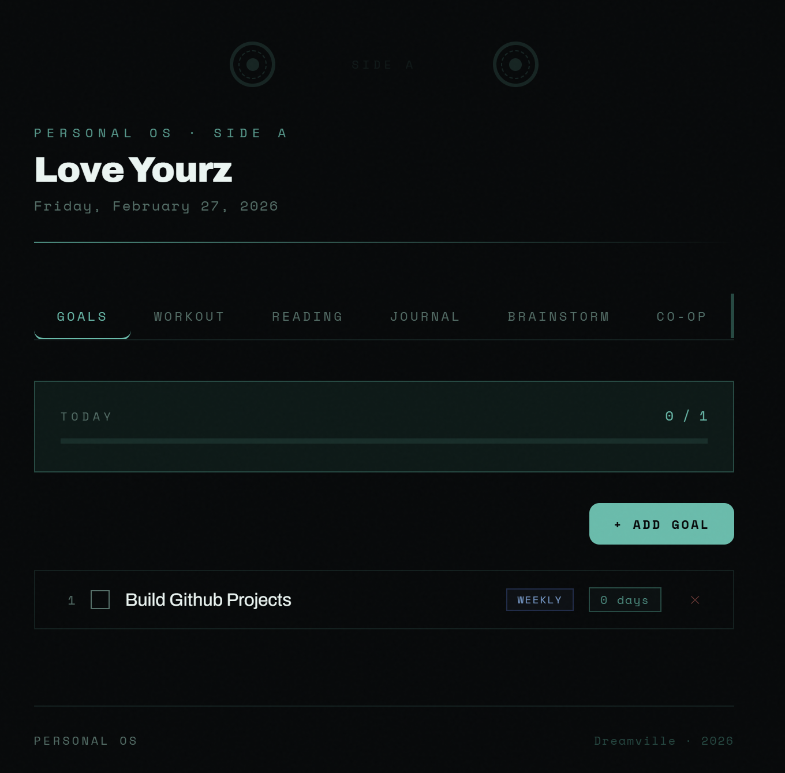

# Personal OS

A personal productivity dashboard built with React. Tracks daily goals, workouts, reading, journal entries, ideas, and co-op job applications — all in one place.

> Aesthetic inspired by the J. Cole *4 Your Eyez Only* cassette — deep black, translucent teal, intimate and minimal.



---

## Features

| Tab | What it does |
|---|---|
| **Goals** | Daily checklist with streak tracking and a today's progress bar |
| **Workout** | Log exercises (sets / reps / weight) per session, view history |
| **Reading** | Library tracker for books, articles, papers, poems, podcasts |
| **Journal** | Checkbox-style entry categories + freeform notes |
| **Brainstorm** | Capture ideas tagged as Dream / Project / Goal / Random / Worry |
| **Co-op** | Track job applications — status, interview rate, offer rate, notes |

All data is saved locally in your browser via `localStorage` — no account, no backend, no data leaves your device.

---

## Tech Stack

- [React](https://react.dev/) via [Vite](https://vitejs.dev/)
- Plain CSS-in-JS (no external UI library)
- `localStorage` for persistence
- Fonts: [Space Mono](https://fonts.google.com/specimen/Space+Mono) + [Archivo](https://fonts.google.com/specimen/Archivo)

---

## Getting Started

### Prerequisites

- [Node.js](https://nodejs.org/) v18 or higher

### Run locally

```bash
# 1. Clone the repo
git clone https://github.com/YOUR_USERNAME/personal-os.git
cd personal-os

# 2. Install dependencies
npm install

# 3. Start the dev server
npm run dev
```

Open [http://localhost:5173](http://localhost:5173) in your browser.

### Build for production

```bash
npm run build
```

Output goes to `dist/` — ready to deploy anywhere.

---

## Deploy

### Vercel (recommended)

```bash
npm install -g vercel
vercel
```

Or connect your GitHub repo at [vercel.com](https://vercel.com) — it auto-deploys on every push.

### Netlify

Drag and drop the `dist/` folder at [netlify.com/drop](https://app.netlify.com/drop).

---

## Install as a Mobile App (PWA)

Once deployed, open the URL in **Safari on iPhone**:

1. Tap the Share button (↑)
2. Tap **Add to Home Screen**
3. Tap Add

It opens fullscreen like a native app with no browser chrome.

---

## Project Structure

```
src/
└── App.jsx        # entire app — all tabs, styles, and logic in one file
public/
├── icon-192.png   # PWA icon (optional)
└── icon-512.png   # PWA icon (optional)
```

---

## Customization

### Change the color theme
Edit the CSS variables at the top of `App.jsx`:

```css
:root {
  --bg:       #07090A;   /* background */
  --teal:     #2ABFAA;   /* accent color */
  --white:    #E8F5F2;   /* text */
}
```

### Add a new tab
1. Create a new component (e.g. `function HabitsTab() { ... }`)
2. Add it to the `TABS` array at the bottom
3. Add `{tab === "habits" && <HabitsTab />}` to the render section

---

## License

MIT — do whatever you want with it, just don't blame me if you miss leg day.
